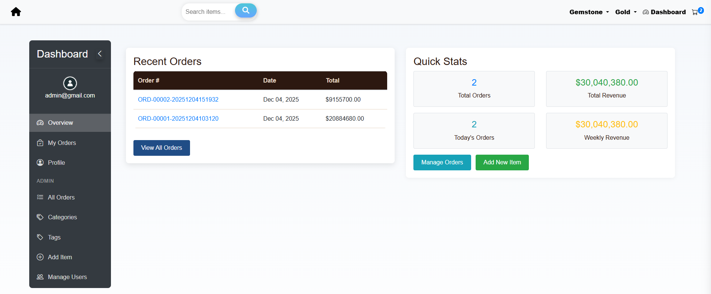
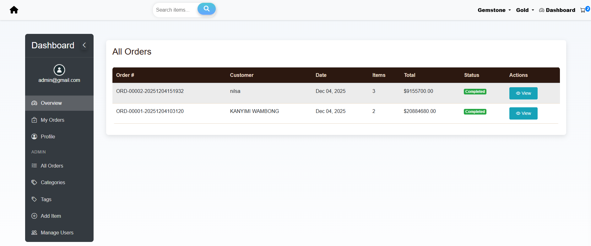
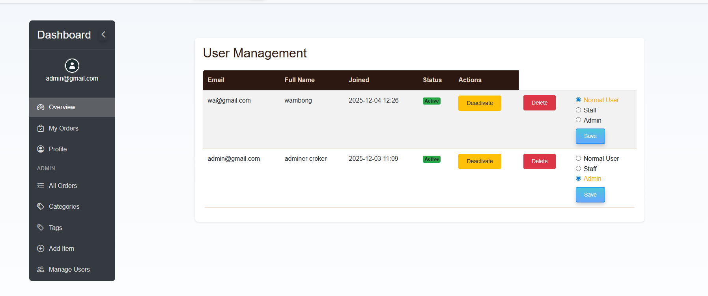
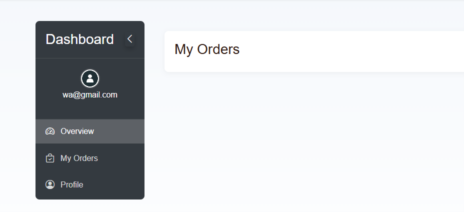
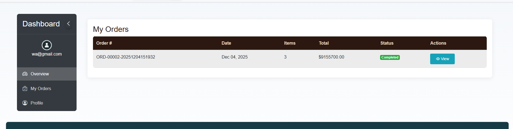
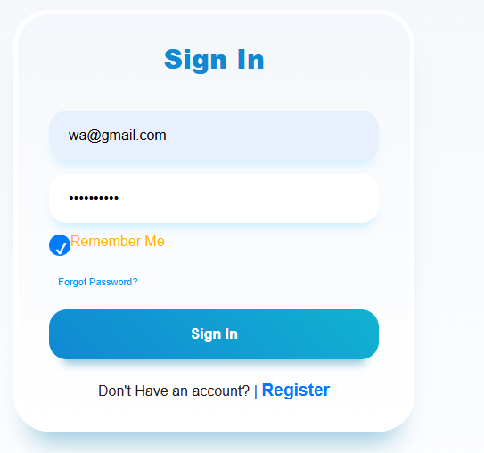
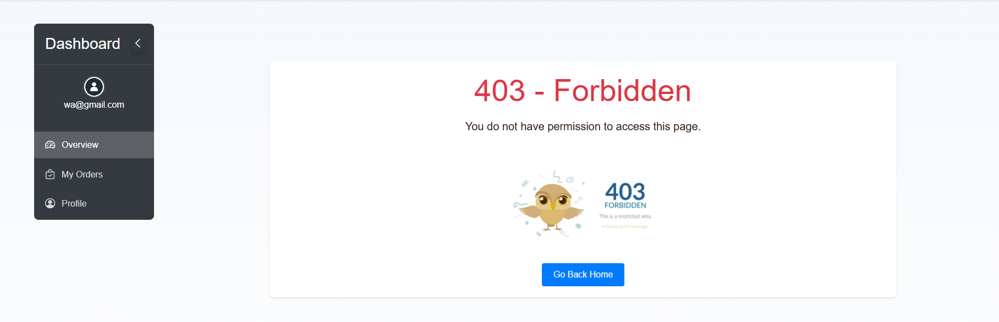
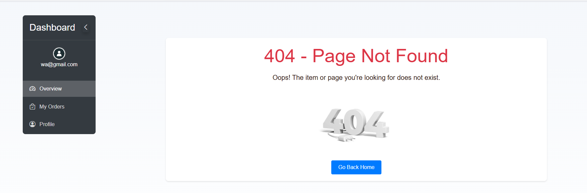

# Cafe Manager – README

Простая, но полностью функциональная система управления кафе и заказами, построенная на **Django** и **SQLite3** (при необходимости легко расширяется до PostgreSQL или MySQL).  
Платформа поддерживает **регистрацию пользователей**, **вход с функцией "Запомнить меня"**, **мягкое удаление аккаунта**, **управление заказами**, **управление товарами**, а также полноценную **админ-панель** с контролем прав доступа.

---

# 📌 Обзор возможностей

## ✔ Возможности обычного пользователя

Авторизованные пользователи могут:

- **Обзорная панель** – просматривать основную информацию об аккаунте и заказах.
- **Мои заказы** – просматривать *только свои собственные заказы*.
- **Профиль** – обновлять личную информацию (имя, email, пароль и т.д.).
- **Создание заказа** – оформлять заказ на доступные товары.
- **Мягкое удаление аккаунта** – пользователь может удалить свой аккаунт в настройках профиля (аккаунт становится неактивным).
- **Вход с функцией "Запомнить меня"**  
  - Если включено, создаётся cookie-сессия на **30 дней**.

---

## ✔ Возможности администратора

Администраторы имеют полный доступ к системе и панели управления:

- **Админ-панель**
- **Все заказы** – просмотр, фильтрация и управление всеми заказами.
- **Категории** – добавление, редактирование и удаление категорий.
- **Теги** – создание, назначение и управление тегами товаров.
- **Добавление товара** – загрузка товаров с изображениями, категориями, тегами и ценами.
- **Редактирование товаров** – обновление или удаление товаров.
- **Управление пользователями**
  - Повышение пользователя до **Администратора**
  - Назначение пользователя **Сотрудником (Staff)**
  - Отзыв прав администратора/сотрудника
- **Просмотр всех заказов пользователей**

### 🔒 Ограничение маршрутов только для администраторов

Если **обычный пользователь** пытается получить доступ к админ-маршрутам, например:


```commandline
http://127.0.0.1:8000/dashboard/admin/orders/
```
Он получает::
``
403 Forbidden
``

Администраторы же имеют полный доступ.

---

## ✔ Обработка ошибок

### **404 – Страница не найдена**
Если пользователь посещает несуществующий товар или страницу, например:
```commandline
http://127.0.0.1:8000/item/6/
```

Отображается настраиваемая: ``
**404 error page**
``

- Аккуратный интерфейс
- Дружелюбное сообщение
- Кнопка возврата на главную страницу

### **Доступ запрещён**
Появляется, когда обычный пользователь пытается открыть страницу только для администраторов.
> ✔ Обе кастомные страницы ошибок работают даже при `DEBUG = True`.

---

# 🛠 Technology Stack

- **Backend:** Django (Python)
- **Database:** SQLite3 (по умолчанию)
- **Шаблоны:** Django Template Engine
- **Аутентификация:** Django Auth + Remember Me (cookie на 30 дней)
- **Права доступа:** Django decorators + собственные проверки прав

Вы можете легко переключиться на **PostgreSQL** или **MySQL** изменив настройки в `settings.py`.

---

# 🔧 Установка и запуск

## 1️⃣ Клонируйте репозиторий
```commandline
git clone https://github.com/Wambong/testtask.git
```
2️⃣ Создайте виртуальное окружение
```commandline
cd testtask/cafeManager
python -m venv venv
source venv/bin/activate        # Mac/Linux
venv\Scripts\activate           # Windows
```
3️⃣ Установите зависимости
```commandline
pip install -r requirements.txt
```
4️⃣ Примените миграции

```commandline
python manage.py migrate
```
5️⃣ Создайте суперпользователя (администратора)
```commandline
python manage.py createsuperuser
```
6️⃣ Запустите сервер разработки
```commandline
python manage.py runserver
```

📂 Структура проекта (важные папки)

```commandline
accounts/               → Аутентификация, профили, права пользователей
orders/                 → Товары, категории, теги и логика заказов
templates/              → HTML шаблоны
static/                 →  Изображения, CSS, JS
cafeManager/readme     → Изображения, используемые только в README.md

```
# 💾 Поддержка баз данных
## База данных по умолчанию: SQLite3
## Чтобы переключиться на PostgreSQL:

```commandline
DATABASES = {
    'default': {
        'ENGINE': 'django.db.backends.postgresql',
        'NAME': 'cafe_db',
        'USER': 'postgres',
        'PASSWORD': '',
        'HOST': 'localhost',
        'PORT': '5432',
    }
}

```
# 🔐 Тестовые аккаунты (для проверки функционала)

## ✅ Аккаунт администратора
# email
```commandline
admin@gmail.com
```
# password
```commandline
Addmminna
``` 
## ✅ Аккаунт обычного пользователя
## normal user 
```commandline
wa@gmail.com
```
```commandline
sfdgjdfg45
```


# email
```commandline
admin@gmail.com
```
# password
```commandline
Addmminna
```
```commandline
http://127.0.0.1:8000/dashboard/
```


```commandline
http://127.0.0.1:8000/dashboard/admin/orders/
```


```commandline
http://127.0.0.1:8000/accounts/admin/users/
```

## normal user 
```commandline
wa@gmail.com
```
```commandline
sfdgjdfg45
```









```commandline
http://127.0.0.1:8000/dashboard/admin/orders/
```


```commandline
http://127.0.0.1:8000/item/6/
```
